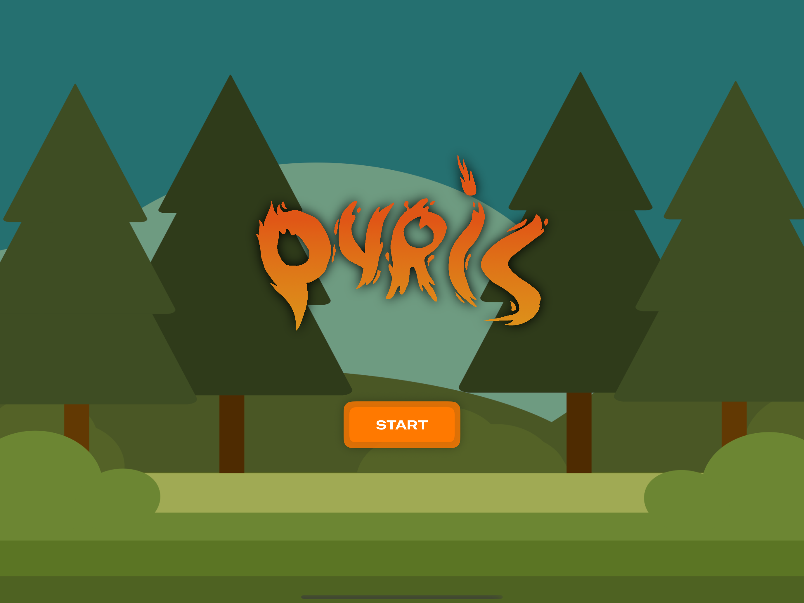
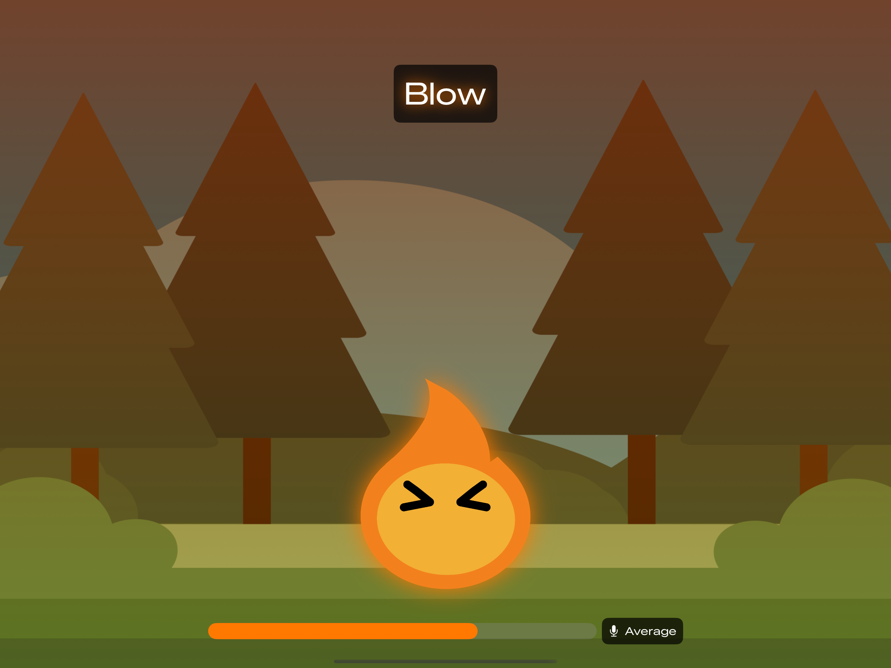
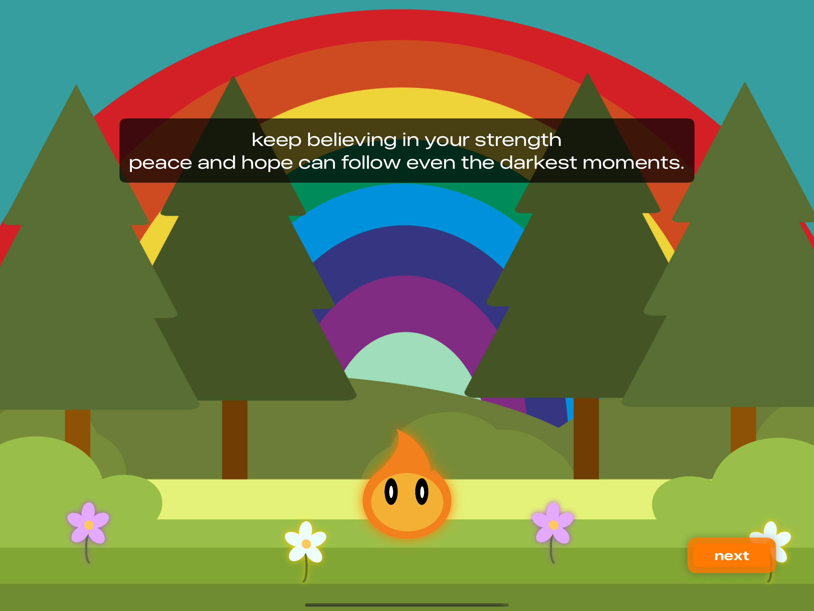

  

# Pyris

**WWDC Swift Student Challenge 2025 Winner**

Pyris is a mindful game designed to help players learn how to cope with panic attacks through the calming power of controlled breathing.

## What is Pyris?

**Breathe in. Hold. Breathe out.**  
Let the rhythm guide you to calm.

In a quiet, enchanted forest, a small flame named Pyris dances freely. But when a storm rolls in – her deepest fear – everything changes.  
Help Pyris find peace, navigate through the fear, and weather the storm.

This is a gentle, emotional journey designed to soothe, not stress.

  
  
  

## Features

- Breathing exercises synchronized with visuals and sound
- Immersive and emotional storytelling
- Hand-drawn animations and atmospheric environments
- Fully offline experience - no ads, no interruptions
- Designed to support emotional regulation and mindfulness

## Availability

Pyris is available on the App Store.  
[Download Pyris](https://apps.apple.com/it/app/pyris/id6746506824) 

## Privacy

Pyris respects your privacy and does not collect, store, or transmit any personal information or user data. The application operates fully offline in a sandboxed environment, ensuring a secure, private learning experience.

---

Thank you for supporting mindful games. 🌿

  

